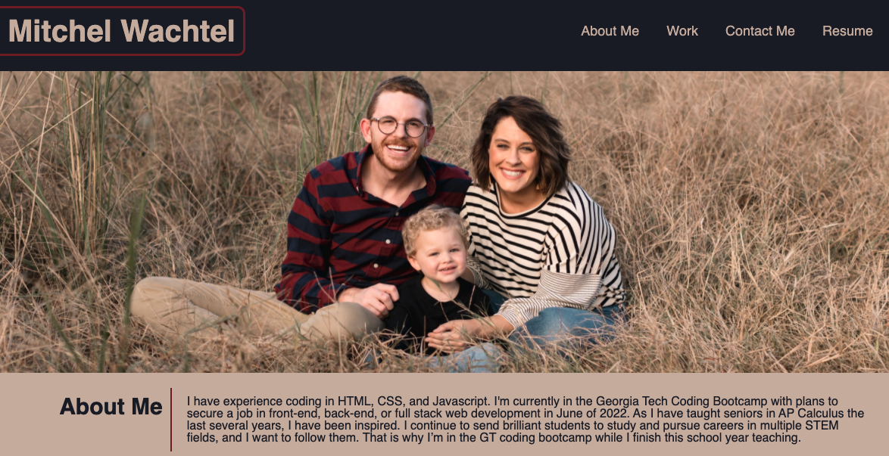
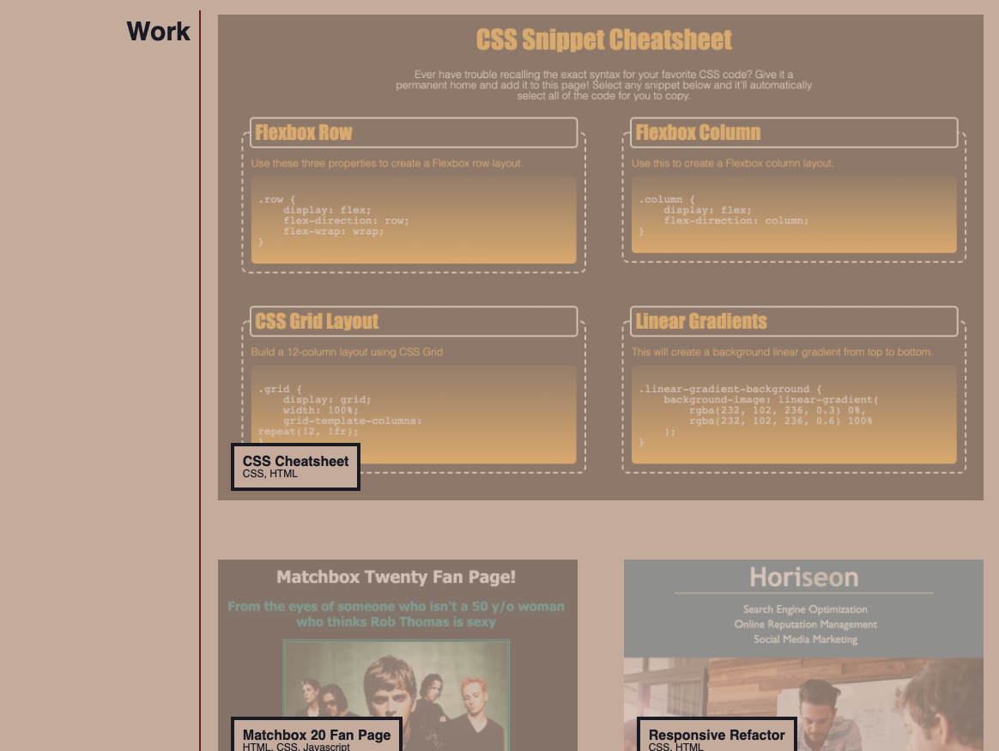
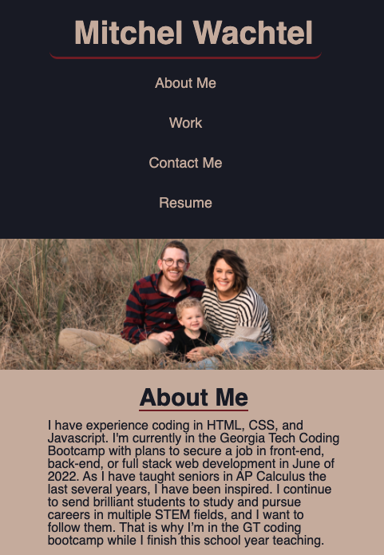
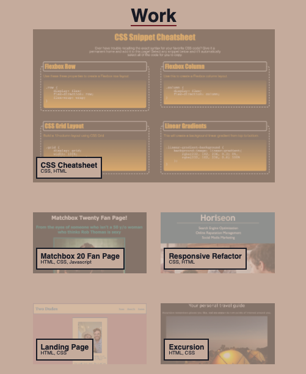
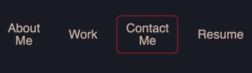

# Portfolio

## Mitchel Wachtel - mitchel.wachtel@gmail.com

---
## Description

Technologies used: HTML, CSS, and GitHub pages in order to publish the site.

My main motivation for this project in the beginning was to better understand the application of CSS Flexbox and the ideas of responsive design.  But, as I got further into the project, I began to feel very proud of my work and my motivation shifted to this being a genuine profolio - a reflection of my abilities and showcase of past and future work.

I learned a ton through my struggles while creating this portfolio. My confidence in containers and using display: flex has greatly increased. The greatest struggle I had was a multi-day desire to get the work-sample preview images to become fully opaque upon hover. I consulted my notes, read articles on hover, looked over the information on FreeCodeCamp, and talked to several individuals. I could not figure out why targeting the images with 'img:hover {opacity: 1;}' did not work. Certainly if an image was already at full opacity, it would not change, and then if it was at the 30% opacity that I set some to, it would change. This did not work. I eventually became successful when I targeted the images more specifically. In talking to a TA, it seems that for hover, sometimes a more specific targeting of the object is required. Needless to say, I'm thankful I was able to find some clarification on it. The other challenge was using relative positioning to place the info for each work sample on top of the image. Although this was not as challenging as the other two I mentioned above, it was not simple and I really appreciated the practice of working with these features.

Next steps will definitely include updating the work-sample sections with more impressive projects that showcase more skills that I currently have and am currenly learning. I would also work on the secondary work sample images. I know it is possible get these to scale down using flex to fill the space properly, but the challenge of also having the info lay on top of the images made this a difficult task at the moment.
---

### **Deployed Site** can be found *[here](https://www.mitchelwachtel.me/portfolio)*. 

---

### **GitHub Repository** can be found *[here](https://github.com/mitchelwachtel/portfolio)*.

---
## Installation 

Simply open in a brower and the webpage should appear as below.

---
## Credits

In order to create a responsive page with CSS flexbox, I used *[this resource](https://css-tricks.com/snippets/css/a-guide-to-flexbox/#background)* from W3 Schools and the *[CSS Flexbox](https://www.freecodecamp.org/learn/responsive-web-design#css-flexbox)* section of freeCodeCamp.org. To create a color scheme I used the app "Sip" to grab specific colors out of the banner picture. 

---
## License

GNU General Public License v3.0
