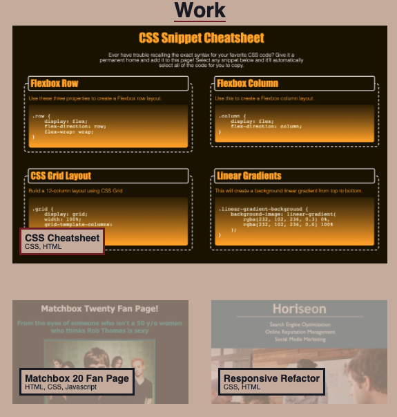

# Portfolio

## Mitchel Wachtel - mitchel.wachtel@gmail.com

---
## Description

Technologies used: HTML, CSS, and GitHub pages in order to publish the site.

My main motivation for this project in the beginning was to better understand the application of CSS Flexbox and the ideas of responsive design.  But, as I got further into the project, I began to feel very proud of my work and my motivation shifted to this being a genuine profolio - a reflection of my abilities and showcase of past and future work.

I learned a ton through my struggles while creating this portfolio. My confidence in containers

---

### **Deployed Site** can be found *[here](https://www.mitchelwachtel.me/portfolio)*. 

---

### **GitHub Repository** can be found *[here](https://github.com/mitchelwachtel/portfolio)*.

---
## Installation 

Simply open in a brower and the webpage should appear as below.

---
## Credits

In order to create a responsive page with CSS flexbox, I used *[this resource](https://css-tricks.com/snippets/css/a-guide-to-flexbox/#background)* from W3 Schools and the *[CSS Flexbox](https://www.freecodecamp.org/learn/responsive-web-design#css-flexbox)* section of freeCodeCamp.org. To create a color scheme I used the app "Sip" to grab specific colors out of the banner picture. 

---
## License

GNU General Public License v3.0
